# SPEEDYDD AUTH SERVICE PROPOSAL

# Overview

The SpeedyDD Auth Service is designed to provide secure, reliable, and user-friendly authentication for both internal users and suppliers. It manages user registration, password setup and recovery, two-factor authentication (2FA), session control, and compliance requirements such as NDA signing. The service ensures that only authorized users can access the application, supports single active sessions, and enforces automatic logout on inactivity to protect sensitive data. For suppliers, the service offers a self-registration portal and secure login processes. All authentication flows are designed to maximize security while maintaining a smooth user experience.

# Requirements

## General User Flow

### 1. Register User

- User accounts are created by administrators via the admin panel.
- An invitation email is sent to the user with a registration link.
- The invitation link is valid for 15 minutes.

### 2. Set Up Password

- Upon receiving the invitation, the user clicks the link to set their password.

### 3. Reset Password

- Users who forget their password can request a password reset.
- A reset email is sent with a link valid for 15 minutes.
- The user can set a new password using the link.

### 4. Set Up Two-Factor Authentication (2FA)

- User sets up 2FA via an authenticator app after the first login or logging in with a recovery code.
- Recovery codes are provided to the user for future 2FA recovery.

### 5. Set Up Payment (Organization Owner Only)

- If the user is an organization owner, they must set up payment information before proceeding to sign the NDA.

### 6. Sign NDA

- User signs the NDA via DocuSeal before accessing the app.

### 7. Verify 2FA

- Users must verify their 2FA when logging in from a new device or browser.

### 8. Recover 2FA

- If 2FA access is lost, users can recover using their recovery codes.
- After recovery, users must set up 2FA again.

### 9. Single Active Session

- Only one active login session is allowed per user.
- Starting a new session terminates the previous session and redirects the user to the login page.

### 10. Auto Logout on Inactivity

- If no actions (API calls) are performed for 30 minutes, the user is automatically logged out.
- A popup notification appears at 25 minutes of inactivity.

### 5. Set Up Payment (Organization Owner Only)

- If the user is an organization owner, they must set up payment information before proceeding to sign the NDA.

### 5. Sign NDA

- User sign NDA via docuseal

### 6. Verify 2FA

- Users must verify their 2FA when logging in from a new device or browser.

### 7. Recover 2FA

- If 2FA access is lost, users can recover using their recovery codes.
- After recovery, users must set up 2FA again.

### 8. Single Active Session

- Only one active login session is allowed per user.
- Starting a new session terminates the previous session and redirects the user to the login page.

### 9. Auto Logout on Inactivity

- If no actions (API calls) are performed for 30 minutes, the user is automatically logged out.
- A popup notification appears at 25 minutes of inactivity.

---

## Supplier Portal Authentication

### 1. Register User

- Users can self-register for a supplier account.

### 2. Login

- Users can log in to the supplier portal.

### 3. Reset Password

- Users can request a password reset if they forget their password.
- A reset email is sent with a link valid for 15 minutes to set a new password.

# Flow

## General User Flow Diagram

### User register

> [!CAUTION]
> If a user drops out of the setup process after setting up their password (e.g., during 2FA setup, payment setup, or NDA signing), the system will resume the incomplete setup steps when the user logs in again. The user must complete all required setup steps before gaining full access to the application.

### User login

> [!NOTE]
> `Is first login on this browser/device?` means either the user is login for the first time on this browser/device, or their previous login was on a different browser/device.

> [!IMPORTANT]
> When a user login, all other active login sessions in other browsers will be notified that there is a new login and automatically redirected to the login page due to the single active session policy.

### User reset password flow

## Supplier Portal Authentication (can create in separate service for only supplier)

Supplier Portal Authentication can be implemented as a separate service dedicated to supplier users. This service manages supplier registration, login, and password recovery, ensuring a secure and streamlined experience for suppliers.

### Supplier Portal User Flow

1. Register User
   - Suppliers can self-register for an account via the portal.
2. Login
   - Suppliers log in to the supplier portal using their credentials.
3. Reset Password
   - If a supplier forgets their password, they can request a password reset.
   - A reset email is sent with a link valid for 15 minutes to set a new password.

## Supplier Portal User Flow Diagram

## Request flow

### User Registration and Setup Sequence Diagram

### User Login Sequence Diagram

### Token Management and Refresh Flow

```mermaid
sequenceDiagram
    participant U as User
    participant A as Auth Service
    participant App as Application

    Note over U,App: Token Structure
    Note over A: Access Token: JWT (contains user claims)
    Note over A: Refresh Token: SQID stored in database + HTTP-only cookie
    Note over U: Access Token: Stored in application state only
    
    Note over U,App: API Request with Expired Token
    U->>App: API request with access token
    App->>A: Request with access token in header
    A->>App: 401 Unauthorized (token expired)
    
    Note over U,App: Token Refresh Flow
    App->>A: Call refresh token API (cookie automatically sent)
    A->>A: Validate refresh token from cookie
    A->>App: Return new access token (JWT)
    App->>App: Update access token in application state
    App->>A: Retry original request with new access token
    A->>App: Success response
    
    Note over U,App: First App Load Flow
    U->>App: Open application (no access token in state)
    App->>App: Check if refresh token exists (in cookie)
    App->>A: Call refresh token API
    A->>App: Return access token (JWT)
    App->>App: Store access token in application state
    App->>A: Call get user profile API
    A->>App: Return user data
    App->>App: Store user data in application state
```

> [!IMPORTANT]
> **Token Storage Security Requirements:**
> - Only **refresh tokens** and **temp tokens** should be stored in cookies (HTTP-only)
> - **Access tokens** and **user information** must ONLY be stored in application state
> - **NEVER** store access tokens or user information in localStorage, sessionStorage, or regular cookies
> - This prevents XSS attacks from accessing sensitive authentication data
