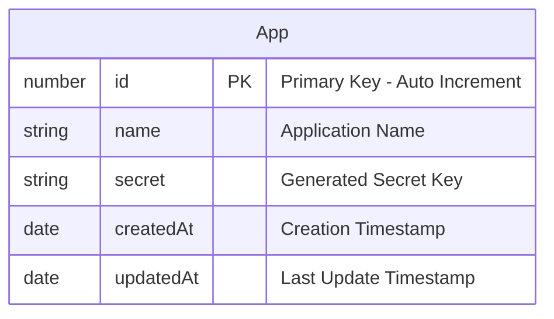

# SPEEDYDD API V1 PROPOSAL

# Overview

The Speedydd API Service is a comprehensive integration hub designed to enable seamless communication between external applications and the Speedydd platform.


# Security

### API Key Authentication
- **Primary Access Method**: Clients authenticate using API keys for programmatic access
- **API Key Format**: Secure, randomly generated keys (e.g., `sk_live_...` for production, `sk_test_...` for testing)
- **Key Management**: API keys are stored securely with proper encryption and rotation policies
- **Rate Limiting**: API keys are subject to rate limiting based on subscription tier and usage patterns

> [!NOTE]
> **API Key Structure**
> 
> Each API key consists of two components:
> - **`app_id`**: Unique identifier for the application integrating with Speedydd API
> - **`api_key`**: Generated secret key for authentication
> 
> Example format: `app_id: "app_12345"` + `api_key: "sk_live_abc123def456"`
> 
> Both values are required in API requests for authentication.

> [!IMPORTANT]
> **Current Implementation Status**
> 
> **Phase 1 (Current)**: Manual API Key Generation
> - We are currently using scripts to generate `app_id` and `api_key` pairs for specific users/applications
> - This approach is temporary and designed for initial testing and limited integrations
> - Only approved applications will receive API credentials during this phase
> 
> **Phase 2 (Future)**: Self-Service API Key Management
> - We will implement a self-service portal where applications can register and generate their own API keys
> - This will include proper onboarding workflows, key rotation, and usage monitoring
> - The implementation timeline will be communicated as we progress through Phase 1 

## Interacting App

### App Registration Requirements

Every application must be registered in our system before accessing the Speedydd API.

> [!IMPORTANT]
> **Manual App Creation (Phase 1)**
> 
> Currently, we manually create applications for our first clients (Pay Solo)
>
> **Future Implementation**: We will develop an automated application creation system that allows clients to self-register and manage their API credentials through a dedicated portal. 


### App Entity



**App Entity Fields:**

| Field | Type | Description | Constraints |
|-------|------|-------------|-------------|
| `id` | number | Primary key, auto-incrementing unique identifier | NOT NULL, PRIMARY KEY, AUTO_INCREMENT |
| `name` | string | Human-readable name of the application | NOT NULL, UNIQUE, VARCHAR(255) |
| `secret` | string | Cryptographically secure random secret for API authentication | NOT NULL, VARCHAR(512) |
| `createdAt` | date | Timestamp when the app was created | NOT NULL, DEFAULT CURRENT_TIMESTAMP |
| `updatedAt` | date | Timestamp when the app was last modified | NOT NULL, DEFAULT CURRENT_TIMESTAMP ON UPDATE CURRENT_TIMESTAMP |

> [!TIP]
> **Generating Secure Random Secrets**
> 
> Use `crypto` module to generate cryptographically secure random secrets:
> 
> ```javascript
> const crypto = require('crypto');
> 
> // Generate a 32-byte (256-bit) random secret
> const secret = crypto.randomBytes(32).toString('hex');
> // Example output: "a1b2c3d4e5f6789012345678901234567890abcdef1234567890abcdef123456"
> 
> // Alternative: Generate base64 encoded secret
> const secretBase64 = crypto.randomBytes(32).toString('base64');
> // Example output: "YWJjZGVmZ2hpamtsbW5vcHFyc3R1dnd4eXoxMjM0NTY="
> 
> // For database storage, hex format is recommended
> // as it's URL-safe and doesn't require special encoding
> ```
> 

## Authentication

All API requests require authentication using `X-App-ID` and `X-API-Key` headers. These credentials are provided when your application is registered in our system.

**Required Headers:**
- `X-App-ID`: Your application identifier
- `X-API-Key`: Your signed authentication token

### API Key Retrieval

When an app requests their API key, we use our private key to sign the app secret and return it as the API key.

**Process:**
1. Retrieve app secret from database using app ID
2. Create token containing only the `secret`
3. Encrypt the token using AES-256
4. Sign the encrypted token with our RSA private key
5. Return the signed token as the API key

**Example:**
```javascript
const crypto = require('crypto');

// Generate signed API key
function generateApiKey(secret) {
  // Encrypt secret
  const encrypted = crypto.privateEncrypt(privateKey, Buffer.from(secret));
  
  // Sign with private key
  const signature = crypto.sign('sha256', encrypted, privateKey);
  
  return signature.toString('base64');
}
```

> [!IMPORTANT]
> **Current Implementation (Phase 1)**
> 
> Currently, we are implementing this API key system for only 1 client (Pay Solo). We will manually:
> - Retrieve the app secret from our database
> - Generate the signed API key using our private key
> - Deliver the API key directly to Pay Solo
> 
> **Future Implementation**: We will develop automated API key generation and retrieval endpoints that allow clients to request their API keys programmatically.

### Authentication Request

When users make API requests, we use our public key to verify the API key signature.

**Process:**
1. Extract `X-App-ID` and `X-API-Key` from request headers
2. Use public key to verify the signature of the API key
3. If signature is valid, decrypt the token to get the secret
4. Compare the secret with the stored secret for that app ID
5. Allow request if verification passes, return 401 if it fails

**Example:**
```javascript
const crypto = require('crypto');

// Verify API key
function verifyApiKey(apiKey, appId) {
  try {
    // Verify signature with public key
    const isValid = crypto.verify('sha256', apiKey, publicKey, signature);
    
    if (isValid) {
      // Decrypt to get secret
      const decrypted = crypto.publicDecrypt(publicKey, apiKey);
      const secret = decrypted.toString();
      
      // Verify secret matches stored secret for app ID
      return verifySecret(secret, appId);
    }
    
    return false;
  } catch (error) {
    return false;
  }
}
```

> [!TIP]
> **Scaling to Multiple API Services**
> 
> When we scale to multiple API services, we can distribute the public key to all services for independent validation:
> 
> - **Centralized Key Management**: Keep private key secure in one location
> - **Distributed Validation**: Each service can validate API keys using the public key
> - **No Network Calls**: Services don't need to call back to a central auth service
> - **Better Performance**: Faster authentication without network latency
> - **Service Independence**: Each service can validate requests independently
> 
> This approach allows for horizontal scaling while maintaining security and performance. 

# Quota Limits

## Rate Limiting Implementation

We implement quota limits using Redis INCR to track API usage per app key with daily request limits.

### Implementation Details

**Redis Key Structure:**
```
quota:{app_id}:{date} = request_count
```

**Example:**
```
quota:app_12345:2024-01-15 = 150
```

### Middleware Implementation

```javascript
const redis = require('redis');
const client = redis.createClient();

// Quota limit middleware
async function quotaLimitMiddleware(req, res, next) {
  const appId = req.headers['x-app-id'];
  const today = new Date().toISOString().split('T')[0]; // YYYY-MM-DD
  const quotaKey = `quota:${appId}:${today}`;
  
  try {
    // Get current count and increment
    const currentCount = await client.incr(quotaKey);
    
    // Set expiration to end of day if first request
    if (currentCount === 1) {
      const tomorrow = new Date();
      tomorrow.setDate(tomorrow.getDate() + 1);
      tomorrow.setHours(0, 0, 0, 0);
      const ttl = Math.floor((tomorrow - new Date()) / 1000);
      await client.expire(quotaKey, ttl);
    }
    
    // Check quota limit (e.g., 1000 requests per day)
    const dailyLimit = 1000;
    if (currentCount > dailyLimit) {
      return res.status(429).json({
        error: 'Quota exceeded',
        limit: dailyLimit,
        remaining: 0,
        resetTime: tomorrow.toISOString()
      });
    }
    
    // Add quota info to response headers
    res.set({
      'X-RateLimit-Limit': dailyLimit,
      'X-RateLimit-Remaining': dailyLimit - currentCount,
      'X-RateLimit-Reset': tomorrow.toISOString()
    });
    
    next();
  } catch (error) {
    console.error('Quota check failed:', error);
    next(); // Allow request if Redis fails
  }
}
```

### Usage in NestJS

```javascript
// NestJS Guard
@Injectable()
export class QuotaGuard implements CanActivate {
  async canActivate(context: ExecutionContext): Promise<boolean> {
    const request = context.switchToHttp().getRequest();
    // Implement quota logic here
    return true;
  }
}
```

### Benefits

- **Daily Reset**: Quota automatically resets at midnight
- **Atomic Operations**: Redis INCR ensures thread-safe counting
- **Performance**: Fast in-memory operations
- **Scalable**: Works across multiple API instances
- **Transparent**: Clear rate limit headers in responses
