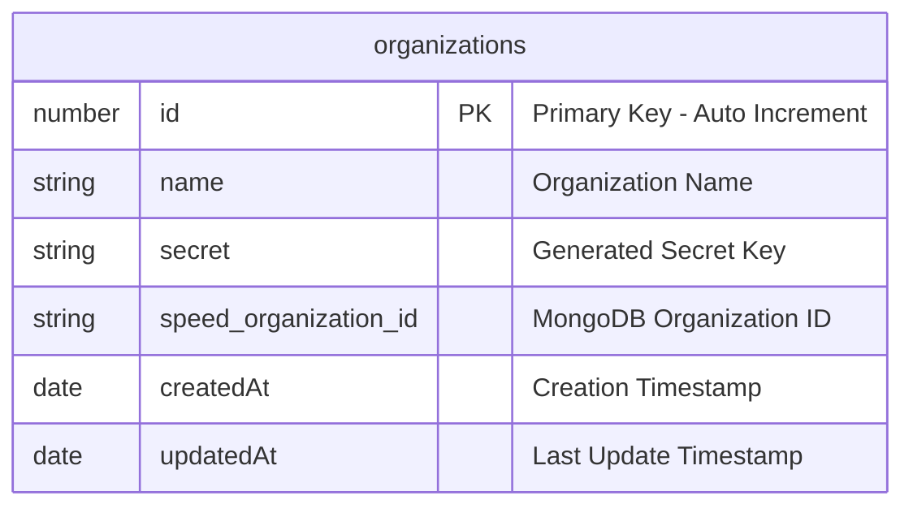
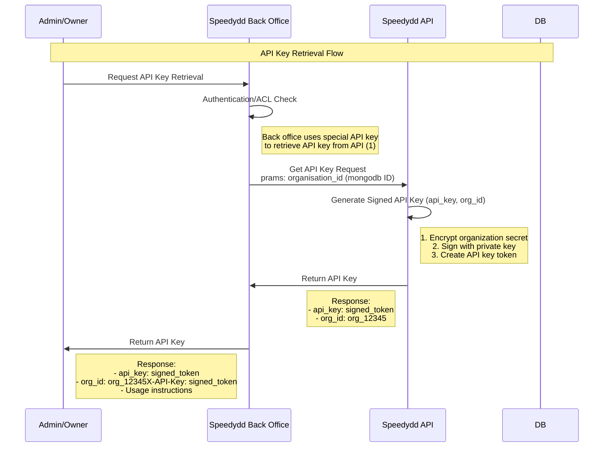

# SPEEDYDD API V1 PROPOSAL

# Overview

The Speedydd API Service is a comprehensive integration hub designed to enable seamless communication between external applications and the Speedydd platform.


# Security

### API Key Authentication
- **Primary Access Method**: Clients authenticate using API keys for programmatic access
- **API Key Format**: Secure, randomly generated keys (e.g., `sk_live_...` for production, `sk_test_...` for testing)
- **Key Management**: API keys are stored securely with proper encryption and rotation policies
- **Rate Limiting**: API keys are subject to rate limiting based on subscription tier and usage patterns

> [!NOTE]
> **API Key Structure**
> 
> Each API key consists of two components:
> - **`org_id`**: Unique identifier for the organization integrating with Speedydd API
> - **`api_key`**: Generated secret key for authentication
> 
> Example format: `org_id: "org_12345"` + `api_key: "sk_live_abc123def456"`
> 
> Both values are required in API requests for authentication.

> [!IMPORTANT]
> **Current Implementation Status**
> 
> **Phase 1 (Current)**: Manual API Key Generation
> - We are currently using scripts to generate `app_id` and `api_key` pairs for specific users/applications
> - This approach is temporary and designed for initial testing and limited integrations
> - Only approved applications will receive API credentials during this phase
> 
> **Phase 2 (Future)**: Self-Service API Key Management
> - We will implement a self-service portal where applications can register and generate their own API keys
> - This will include proper onboarding workflows, key rotation, and usage monitoring
> - The implementation timeline will be communicated as we progress through Phase 1 

## Interacting Organization

### Organization Registration Requirements

Every organization must be registered in our system before accessing the Speedydd API.

> [!IMPORTANT]
> **Manual Organization Creation (Phase 1)**
> 
> Currently, we manually create organizations for our first clients (Pay Solo)
>
> **Future Implementation**: We will develop an automated organization creation system that allows clients to self-register and manage their API credentials through a dedicated portal. 


### Organization Entity



**Organizations Entity Fields:**

| Field | Type | Description | Constraints |
|-------|------|-------------|-------------|
| `id` | number | Primary key, auto-incrementing unique identifier | NOT NULL, PRIMARY KEY, AUTO_INCREMENT |
| `name` | string | Human-readable name of the organization | NOT NULL, UNIQUE, VARCHAR(255) |
| `secret` | string | Cryptographically secure random secret for API authentication | NOT NULL, VARCHAR(512) |
| `speed_organization_id` | string | MongoDB organization ID from legacy database | NOT NULL, UNIQUE, VARCHAR(100) |
| `createdAt` | date | Timestamp when the organization was created | NOT NULL, DEFAULT CURRENT_TIMESTAMP |
| `updatedAt` | date | Timestamp when the organization was last modified | NOT NULL, DEFAULT CURRENT_TIMESTAMP ON UPDATE CURRENT_TIMESTAMP |

> [!CAUTION]
> **Database Migration & Linking**
> 
> Since the new Speedydd API project uses PostgreSQL while the existing Speedydd application uses MongoDB, we need to link organizations between the two systems:
> 
> - **`speed_organization_id`**: Contains the MongoDB ObjectId from the legacy database
> - **Purpose**: Enables data correlation and migration between old and new systems
> - **Migration Strategy**: Organizations will be created in PostgreSQL with their corresponding MongoDB IDs
> - **Data Integrity**: Ensures seamless integration during the transition period
> 
> This linking approach allows the API to reference existing organization data while maintaining separation between the two database systems.

> [!TIP]
> **Generating Secure Random Secrets**
> 
> Use `crypto` module to generate cryptographically secure random secrets:
> 
> ```javascript
> const crypto = require('crypto');
> 
> // Generate a 32-byte (256-bit) random secret
> const secret = crypto.randomBytes(32).toString('hex');
> // Example output: "a1b2c3d4e5f6789012345678901234567890abcdef1234567890abcdef123456"
> 
> // Alternative: Generate base64 encoded secret
> const secretBase64 = crypto.randomBytes(32).toString('base64');
> // Example output: "YWJjZGVmZ2hpamtsbW5vcHFyc3R1dnd4eXoxMjM0NTY="
> 
> // For database storage, hex format is recommended
> // as it's URL-safe and doesn't require special encoding
> ```
> 

## Authentication

All API requests require authentication using `X-Org-ID` and `X-API-Key` headers. These credentials are provided when your organization is registered in our system.

**Required Headers:**
- `X-Org-ID`: Your organization identifier
- `X-API-Key`: Your signed authentication token

### API Key Retrieval

When an organization requests their API key, we use our private key to sign the organization secret and return it as the API key.

**Process:**
1. Retrieve organization secret from database using organization ID
2. Create token containing only the `secret`
3. Encrypt the token using AES-256
4. Sign the encrypted token with our RSA private key
5. Return the signed token as the API key

**Example:**
```javascript
const crypto = require('crypto');

// Generate signed API key
function generateApiKey(secret) {
  // Encrypt secret
  const encrypted = crypto.privateEncrypt(privateKey, Buffer.from(secret));
  
  // Sign with private key
  const signature = crypto.sign('sha256', encrypted, privateKey);
  
  return signature.toString('base64');
}
```

> [!IMPORTANT]
> **Current Implementation (Phase 1)**
> 
> Currently, we are implementing this API key system for only 1 client (Pay Solo). We will manually:
> - Retrieve the organization secret from our database
> - Generate the signed API key using our private key
> - Deliver the API key directly to Pay Solo
> 
> **Future Implementation**: We will develop automated API key generation and retrieval endpoints that allow organizations to request their API keys programmatically.

### Authentication Request

When users make API requests, we use our public key to verify the API key signature.

**Process:**
1. Extract `X-Org-ID` and `X-API-Key` from request headers
2. Use public key to verify the signature of the API key
3. If signature is valid, decrypt the token to get the secret
4. Compare the secret with the stored secret for that organization ID
5. Allow request if verification passes, return 401 if it fails

**Example:**
```javascript
const crypto = require('crypto');

// Verify API key
function verifyApiKey(apiKey, orgId) {
  try {
    // Verify signature with public key
    const isValid = crypto.verify('sha256', apiKey, publicKey, signature);
    
    if (isValid) {
      // Decrypt to get secret
      const decrypted = crypto.publicDecrypt(publicKey, apiKey);
      const secret = decrypted.toString();
      
      // Verify secret matches stored secret for organization ID
      return verifySecret(secret, orgId);
    }
    
    return false;
  } catch (error) {
    return false;
  }
}
```

> [!TIP]
> **Scaling to Multiple API Services**
> 
> When we scale to multiple API services, we can distribute the public key to all services for independent validation:
> 
> - **Centralized Key Management**: Keep private key secure in one location
> - **Distributed Validation**: Each service can validate API keys using the public key
> - **No Network Calls**: Services don't need to call back to a central auth service
> - **Better Performance**: Faster authentication without network latency
> - **Service Independence**: Each service can validate requests independently
> 
> This approach allows for horizontal scaling while maintaining security and performance. 

# Quota Limits

## Rate Limiting Implementation

We implement quota limits using Redis INCR to track API usage per organization key with daily request limits.

### Implementation Details

**Redis Key Structure:**
```
quota:{org_id}:{date} = request_count
```

**Example:**
```
quota:org_12345:2024-01-15 = 150
```

### Middleware Implementation

```javascript
const redis = require('redis');
const client = redis.createClient();

// Quota limit middleware
async function quotaLimitMiddleware(req, res, next) {
  const orgId = req.headers['x-org-id'];
  const today = new Date().toISOString().split('T')[0]; // YYYY-MM-DD
  const quotaKey = `quota:${orgId}:${today}`;
  
  try {
    // Get current count and increment
    const currentCount = await client.incr(quotaKey);
    
    // Set expiration to end of day if first request
    if (currentCount === 1) {
      const tomorrow = new Date();
      tomorrow.setDate(tomorrow.getDate() + 1);
      tomorrow.setHours(0, 0, 0, 0);
      const ttl = Math.floor((tomorrow - new Date()) / 1000);
      await client.expire(quotaKey, ttl);
    }
    
    // Check quota limit (e.g., 1000 requests per day)
    const dailyLimit = 1000;
    if (currentCount > dailyLimit) {
      return res.status(429).json({
        error: 'Quota exceeded',
        limit: dailyLimit,
        remaining: 0,
        resetTime: tomorrow.toISOString()
      });
    }
    
    // Add quota info to response headers
    res.set({
      'X-RateLimit-Limit': dailyLimit,
      'X-RateLimit-Remaining': dailyLimit - currentCount,
      'X-RateLimit-Reset': tomorrow.toISOString()
    });
    
    next();
  } catch (error) {
    console.error('Quota check failed:', error);
    next(); // Allow request if Redis fails
  }
}
```

### Usage in NestJS

```javascript
// NestJS Guard
@Injectable()
export class QuotaGuard implements CanActivate {
  async canActivate(context: ExecutionContext): Promise<boolean> {
    const request = context.switchToHttp().getRequest();
    // Implement quota logic here
    return true;
  }
}
```

### Benefits

- **Daily Reset**: Quota automatically resets at midnight
- **Atomic Operations**: Redis INCR ensures thread-safe counting
- **Performance**: Fast in-memory operations
- **Scalable**: Works across multiple API instances
- **Transparent**: Clear rate limit headers in responses

# Integration with Current Speedydd Back Office
> [!IMPORTANT]
> **Direct Database Access Architecture**
> 
> The Speedydd API will **NOT** call any APIs to the Speedydd back office system. Instead, it will:
> 
> - **Direct Database Connection**: Connect directly to the back office database
> - **Query Data Directly**: Query data from the database without API intermediaries
> - **No API-to-API Calls**: Avoid additional network overhead and complexity
> - **Improved Performance**: Faster data access through direct database queries
> - **Simplified Architecture**: Reduces the number of moving parts in the system
> 
> This approach ensures efficient data access and reduces latency for API consumers. 

## Retrieved API Key From Back Office

### API Key Retrieval Flow



> [!IMPORTANT]
> **Back Office Authentication Key**
> 
> At (1), Speedydd back office uses a **priority key** to authenticate with Speedydd API:
> 
> - **Private Key**: Stored securely in our cloud private key management system
> - **Authentication Method**: Back office includes this key in request headers for every API call
> - **Recognition**: Speedydd API recognizes and validates this key to authorize back office requests
> - **Security**: This key is separate from organization API keys and has elevated privileges
> - **Access Control**: Only Speedydd back office systems can use this key
> 
> **Example Header:**
> ```http
> X-BackOffice-Key: priority_key_abc123def456
> ```
> 
> This ensures that only authorized back office systems can retrieve API keys for organizations. 

## Speedydd API Integration

### Using API Credentials

Once users obtain their `api_key` and `org_id` from the back office, they can integrate with the Speedydd API using these credentials.

### Authentication

All API requests must include the organization credentials in the request headers:

```http
X-Org-ID: org_12345
X-API-Key: signed_encrypted_token
```

### Example API Endpoints

The Speedydd API provides various endpoints for different operations:

**Base URL:** `https://api.speedydd.com/v1`

**Common Endpoints:**
- `GET /organizations` - Get organization information
- `POST /organizations` - Create new organization
- `GET /organizations/{id}` - Get specific organization details
- `PUT /organizations/{id}` - Update organization information
- `DELETE /organizations/{id}` - Delete organization

### Example Integration

```javascript
// Example API call using Node.js
const axios = require('axios');

const apiClient = axios.create({
  baseURL: 'https://api.speedydd.com/v1',
  headers: {
    'X-Org-ID': 'org_12345',
    'X-API-Key': 'signed_encrypted_token',
    'Content-Type': 'application/json'
  }
});

// Get organization information
async function getOrganization() {
  try {
    const response = await apiClient.get('/organizations');
    console.log('Organization data:', response.data);
    return response.data;
  } catch (error) {
    console.error('API Error:', error.response?.data || error.message);
  }
}

// Create new organization
async function createOrganization(orgData) {
  try {
    const response = await apiClient.post('/organizations', orgData);
    console.log('Organization created:', response.data);
    return response.data;
  } catch (error) {
    console.error('API Error:', error.response?.data || error.message);
  }
}
```

### Response Format

All API responses follow a consistent format:

**Success Response:**
```json
{
  "success": true,
  "data": {
    "id": "org_12345",
    "name": "Organization Name",
    "created_at": "2024-01-15T10:30:00Z"
  },
  "message": "Operation completed successfully"
}
```

**Error Response:**
```json
{
  "success": false,
  "error": {
    "code": "UNAUTHORIZED",
    "message": "Invalid API credentials",
    "details": "The provided API key is invalid or expired"
  }
}
```

### Rate Limiting

API requests are subject to rate limiting based on your organization's subscription tier:

- **Headers included in responses:**
  - `X-RateLimit-Limit`: Maximum requests per day
  - `X-RateLimit-Remaining`: Remaining requests for today
  - `X-RateLimit-Reset`: Time when the limit resets

### Error Handling

Common HTTP status codes:
- `200` - Success
- `400` - Bad Request (invalid data)
- `401` - Unauthorized (invalid credentials)
- `403` - Forbidden (insufficient permissions)
- `404` - Not Found
- `429` - Too Many Requests (rate limit exceeded)
- `500` - Internal Server Error
